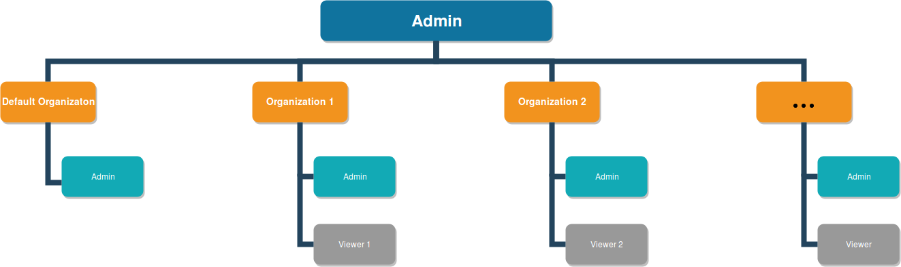
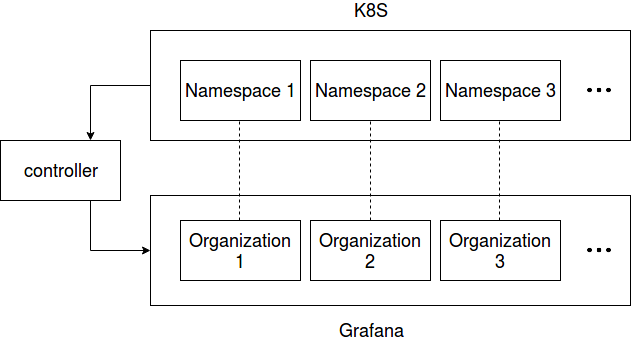

# k8s-grafana-controller

A grafana multi-tenancy management tool, written in Go with the [client-go](https://github.com/kubernetes/client-go) library.

With the controller, a grafana organization is bond with a Kubernetes tenant. Each organization has a viewer and the viewer is only added to that specific organization. Dashboards in an organization only show resources of a related tenant. In this way what a viewer can see is restricted to certain resources.



A server admin controls all the organizations. The controller creates a server admin account and uses that account after initialization. So when the server admin changes password, the controller will not be affected.


In one organization, there are Pod, Deployment and StatefulSet dashboards. For now, tenants are managed using kubernetes namespaces, so the dashboards in an organization only show data of the related namespace. Additionally, the default organization shows all the namespaces and has dashboards showing the cluster status. Only the server admin is in that organization.

The controller watches Kubernetes namespaces and the grafana pod. It will create all the tenants if the grafana pod is deleted.
And if a namespace is added/deleted, a grafana organization will be added/deleted accordingly.



## Usage  

Server admin access is needed to use the controller.

The manifests shows an example of how to use the controller.
In grafana-controller-deploy.yaml, modify the environment variables
```  
- name: GRAFANA_IP
  value: "10.110.150.206"
- name: PROMETHEUS_IP
  value: "10.103.171.47"
```  
And in grafana-controller-secret.yaml, add the server admin account name and password using base64 encryption.
```
data:
  username: YWRtaW4=
  password: YWRtaW4=
```
